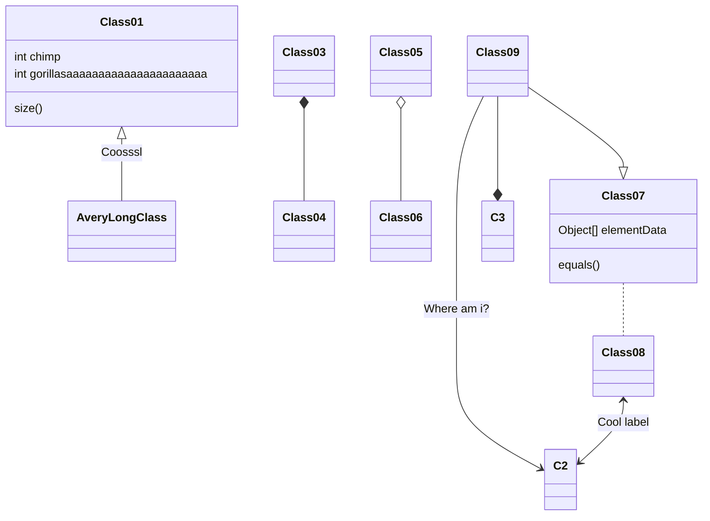
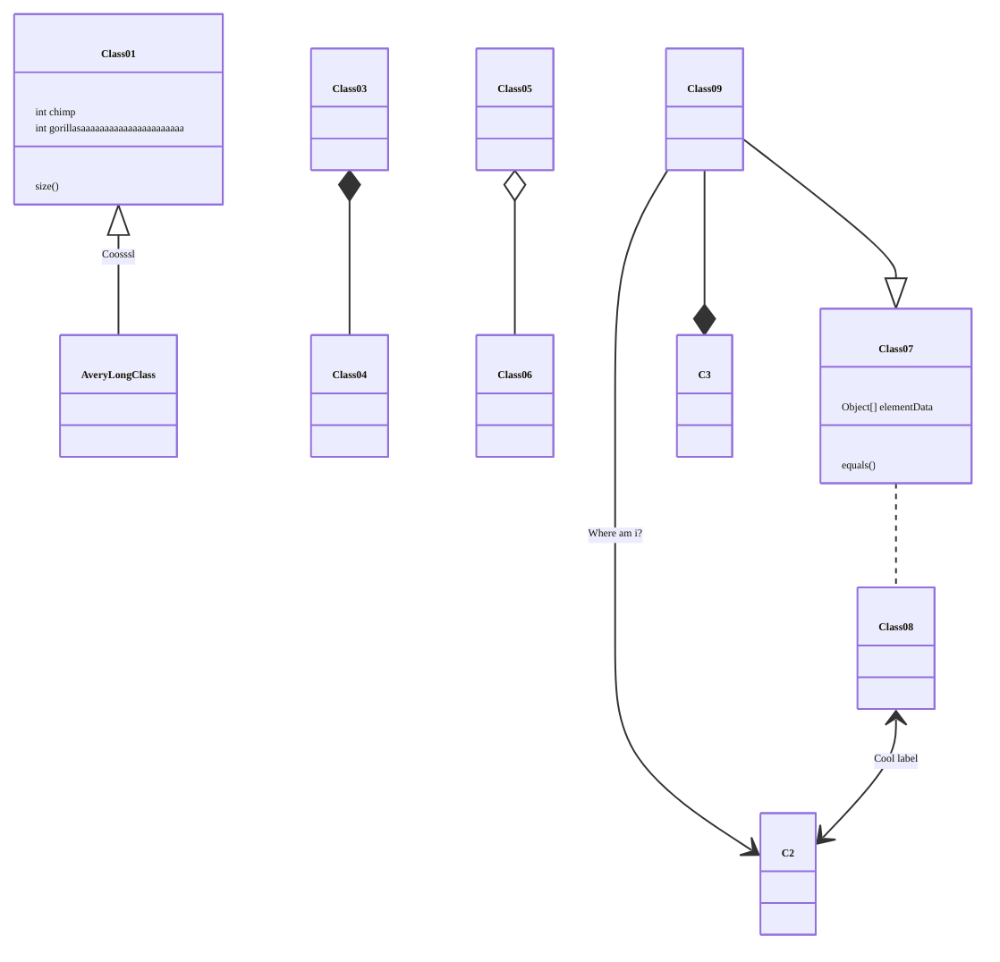
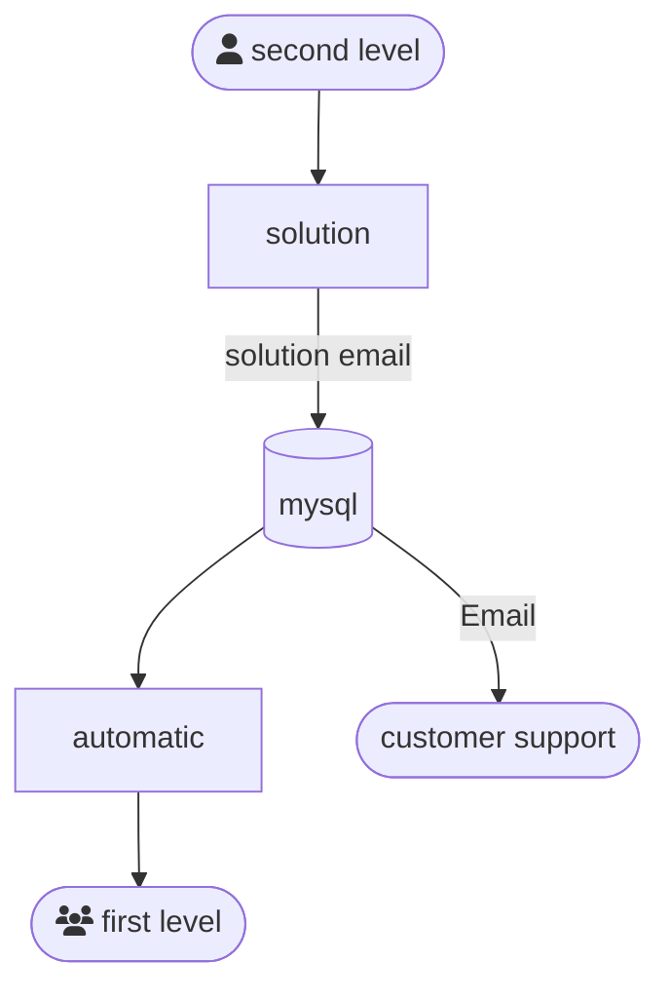
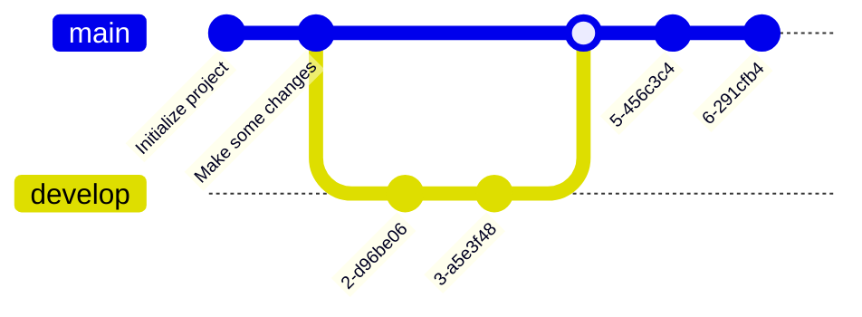

+++

title = "Guide for writing markdown slides"
description = "A Hugo theme for creating Reveal.js presentations"
outputs = ["Reveal"]
aliases = [
    "/guide/"
]

+++

{}
Today's date! `{}`
{}

# Short guide to Markdown slides
## This has much potential

---
{}

# Typography

{}
Slide down!
{}

$\downarrow$

---

{}
{}
# Headers
{}
{}

# H1
## H2
### H3
#### H4
##### H5
###### H6

{}
{}

---

{}
{}
# Text
{}

{}
normal text

`inline code`

*italic*

**bold**

**_emphasized_**

*__emphasized alternative__*

~~strikethrough~~

[link to google](http://www.google.com)
{}

{}

---

{}
{}
# Lists
{}
{}

1. First ordered list item
1. Another item
    * Unordered sub-list.
    * with two items
        * another sublist
            1. With a sub-enum
            1. yay!
1. Actual numbers don't matter, just that it's a number
  1. Ordered sub-list
1. And another item.

{}
{}

{}

---

{}

{}
# UI Blocks
{}

Slide down!

$\downarrow$

---

{}
{}
# Callouts

{}
skrr skrr blea blea
{}

{}
skrr skrr blea blea
{}

{}

{}
{}
this must be a great tip
{}

{}
this is an information, or a note
{}

{}
Yay!
{}

{}
something went possibly wrong :/
{}

{}
just a warning
{}

{}
{}

---

# Code Blocks
pt#01

## inline

You can play around with this `code` or `pwd`

---

{}

# Code Blocks
pt#02

## inside code blocks
{}

```java { linenos=inline hl_lines=["4-6"] }
import System;

class Program {
  public static void main(string[] args) {
    System.out.println("Hello, World!");
  }
}
```
{}

{}
{}
You can even highlight some lines of code!
{}
{}

{}


---

{}
## from file

{}

---


#### Inline images

---

## Fallback to shortcodes for resizing

Autoresize specifying

* `max-w` (percent of parent element width) and/or `max-h` (percent of viewport height) as max sizes , and
* `width` and/or `height` as *exact* sizes (as percent of viewport size)

---

{}


## **With background!**

Explore the `static/animations` folder to find out more!

---



## **Hexagons everywhere**

---



## **Melting lines**

---



## **Ribbons**

---



## **Particles**

---



## Grainient

{}

---

## Tick and Cross

* {} This is something good
* {} This is something bad

---

## Chart.js


{
    type: 'bar',
    data: {
        labels: ['Red', 'Blue', 'Yellow', 'Green', 'Purple', 'Orange'],
        datasets: [{
            label: 'Bar Chart',
            data: [12, 19, 18, 16, 13, 14],
            backgroundColor: [
                'rgba(255, 99, 132, 0.2)',
                'rgba(54, 162, 235, 0.2)',
                'rgba(255, 206, 86, 0.2)',
                'rgba(75, 192, 192, 0.2)',
                'rgba(153, 102, 255, 0.2)',
                'rgba(255, 159, 64, 0.2)'
            ],
            borderColor: [
                'rgba(255, 99, 132, 1)',
                'rgba(54, 162, 235, 1)',
                'rgba(255, 206, 86, 1)',
                'rgba(75, 192, 192, 1)',
                'rgba(153, 102, 255, 1)',
                'rgba(255, 159, 64, 1)'
            ],
            borderWidth: 1
        }]
    },
    options: {
        maintainAspectRatio: false,
        scales: {
            yAxes: [{
                ticks: {
                    beginAtZero: true
                }
            }]
        }
    }
}


---

## FontAwesome

<i class="fa-solid fa-mug-hot"></i>
<i class="fa-solid fa-lemon"></i>
<i class="fa-solid fa-flask"></i>
<i class="fa-solid fa-apple-whole"></i>
<i class="fa-solid fa-bacon"></i>
<i class="fa-solid fa-beer-mug-empty"></i>
<i class="fa-solid fa-pepper-hot"></i>

---

## Bootstrap 1

<div class="card w-100" >
  
  <div class="card-body">
    <h5 class="card-title">Card title</h5>
    <p class="card-text">Some quick example text to build on the card title and make up the bulk of the card's content.</p>
    <a href="#" class="btn btn-primary">Go somewhere</a>
  </div>
</div>

---

## Bootstrap 2

<button type="button" class="btn btn-primary">Primary</button>
<button type="button" class="btn btn-secondary">Secondary</button>
<button type="button" class="btn btn-success">Success</button>
<button type="button" class="btn btn-danger">Danger</button>
<button type="button" class="btn btn-warning">Warning</button>
<button type="button" class="btn btn-info">Info</button>
<button type="button" class="btn btn-light">Light</button>
<button type="button" class="btn btn-dark">Dark</button>

<button type="button" class="btn btn-link">Link</button>

---

## Low res, plain markdown


---

## Hi res, plain markdown


---



# Large images as background
## (May affect printing)

---




# Video background

---

{}
{}
{}
# $$\LaTeX{}$$
{}
{}

{}

$\textbf{Exercise}$ 

Prove that $a_n = \frac{2n + 1}{n + 2} \xrightarrow[n \to +\infty]{} 2$.

$\textbf{Proof}$ 

Given $\varepsilon > 0,\ \exists m_\varepsilon \in \mathbb{N}:$
<div>
\begin{equation}
    \begin{split}
        \left\lvert a_n - l \right\rvert &= \left\lvert \frac{2n + 1}{n + 2} - 2 \right\rvert \leq \varepsilon, \qquad \forall n \in \mathbb{N} \\
        &= \left\lvert \frac{2n + 1 -2n - 4}{n + 2} \right\rvert \leq \varepsilon \\ 
        &\Longleftrightarrow \frac{3}{n + 2} \leq \varepsilon \\
        &\Longleftrightarrow n + 2 \geq \frac{3}{\varepsilon} \\
        &\Longleftrightarrow n \geq \frac{3}{\varepsilon} - 2
    \end{split}
\end{equation}
</div>

I can choose $m_\varepsilon = \left[\frac{3}{\varepsilon} - 2\right] + 1$ in order to satisfy the limit. $\\#$
{}
{}


---

# Code snippets

```kotlin { linenos=inline }
val x = pippo
```

```go { linenos=inline, hl_lines=["5-7"]  }
package main

import "fmt"

func main() {
    fmt.Println("Hello world!")
}
```

You can highlight some lines of code!

---

# Tables

Colons can be used to align columns.

| Tables        | Are           | Cool  |
| ------------- |:-------------:| -----:|
| col 3 is      | right-aligned | $1600 |
| col 2 is      | centered      |   $12 |
| zebra stripes | are neat      |    $1 |

There must be at least 3 dashes separating each header cell.
The outer pipes (|) are optional, and you don't need to make the
raw Markdown line up prettily. You can also use inline Markdown.

---

# Quotes

> Multiple
> lines
> of
> a
> single
> quote
> get
> joined

> Very long one liners of Markdown text automatically get broken into a multiline quotation, which is then rendered in the slides.

---

# Fragments

* 
* 
* 

---

# Stacking images with Fragments
{}
{}
<p class="fragment" data-fragment-index="0">Pippo</p>
<p class="fragment" data-fragment-index="1">Pluto</p>
<p class="fragment" data-fragment-index="2">Paperino</p>
{}

{}
<div class="r-stack">
  
  
  
</div>
{}

{}


---

# Graphs via Gravizo


  digraph G {
    aize ="4,4";
    main [shape=box];
    main -> parse [weight=8];
    parse -> execute;
    main -> init [style=dotted];
    main -> cleanup;
    execute -> { make_string; printf}
    init -> make_string;
    edge [color=red];
    main -> printf [style=bold,label="100 times"];
    make_string [label="make a string"];
    node [shape=box,style=filled,color=".7 .3 1.0"];
    execute -> compare;
  }


---

# Graphs via mermaid.js



---


# Graphs via mermaid.js with options




---
# Graphs via mermaid.js 2



---

# Graphs via mermaid.js 3



---

# Keystrokes

<kbd>Ctrl</kbd> + <kbd>Alt</kbd> + <kbd>Del</kbd>

---

# QR code

{}

---

# Import shared slides

<!-- write-here "shared-slides/devops/devops-intro.md" -->
<!-- end-write -->
